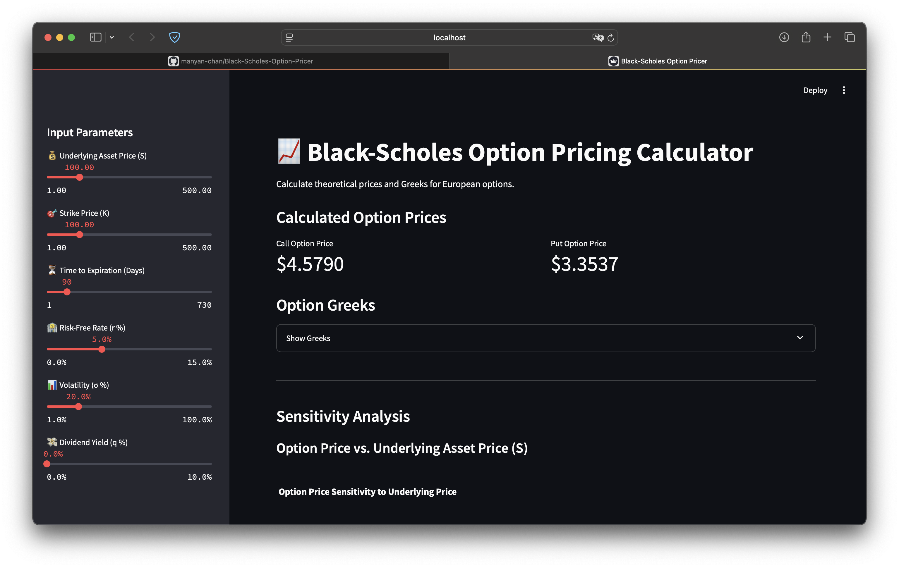

# Black-Scholes Option Pricing Calculator

[](https://www.python.org/)
[](https://streamlit.io/)
[](https://opensource.org/licenses/MIT)

A web application built with Streamlit to calculate the theoretical price and Greeks for European call and put options using the Black-Scholes model.

## Features

*   **European Option Pricing:** Calculates theoretical Call and Put prices based on the Black-Scholes formula.
*   **Option Greeks Calculation:** Computes key sensitivity metrics: Delta, Gamma, Vega, Theta, and Rho for both Call and Put options.
*   **Interactive Inputs:** Uses sliders for easy adjustment of all model parameters:
    *   Underlying Asset Price (S)
    *   Strike Price (K)
    *   Time to Expiration (T, in days)
    *   Risk-Free Interest Rate (r)
    *   Volatility (σ)
    *   Dividend Yield (q)
*   **Sensitivity Analysis:** Visualizes how option prices change with variations in:
    *   Underlying Asset Price
    *   Time to Expiration
    *   Volatility
*   **Clear Output:** Displays calculated prices and Greeks using Streamlit metrics. Greeks are shown in an expandable section.
*   **Plotly Visualizations:** Uses interactive Plotly charts for sensitivity analysis.

## How it Works

The application implements the standard Black-Scholes formula to determine the theoretical fair value of European options. It also calculates the first-order Greeks:

*   **Delta:** Rate of change of option price relative to the underlying asset price.
*   **Gamma:** Rate of change of Delta relative to the underlying asset price.
*   **Vega:** Sensitivity of option price to changes in volatility (per 1% change).
*   **Theta:** Sensitivity of option price to the passage of time (per day decrease).
*   **Rho:** Sensitivity of option price to changes in the risk-free interest rate (per 1% change).

## Screenshot

 

## Installation & Setup

1.  **Clone the repository (or download the script):**
    ```bash
    git clone https://github.com/manyan-chan/Black-Scholes-Option-Pricer.git
    cd Black-Scholes-Option-Pricer
    ```

2.  **Create and activate a virtual environment (Recommended):**
    ```bash
    python -m venv venv
    # On Windows
    venv\Scripts\activate
    # On macOS/Linux
    source venv/bin/activate
    ```

3.  **Create a `requirements.txt` file:**
    Create a file named `requirements.txt` in the project's root directory with the following content:
    ```txt
    streamlit
    numpy
    pandas
    scipy
    plotly
    ```

4.  **Install the required libraries:**
    ```bash
    pip install -r requirements.txt
    ```

## Usage

1.  **Run the Streamlit application:**
    ```bash
    streamlit run option_pricer.py
    ```

2.  **Open your web browser:** Streamlit will typically open the app automatically or provide a local URL (like `http://localhost:8501`).

3.  **Interact with the app:**
    *   Use the sliders in the sidebar to adjust the input parameters.
    *   The calculated option prices, Greeks, and sensitivity plots will update automatically.

## Dependencies

*   [Streamlit](https://streamlit.io/): For creating the web application interface.
*   [NumPy](https://numpy.org/): For numerical operations.
*   [Pandas](https://pandas.pydata.org/): For data manipulation (used for plotting data).
*   [SciPy](https://scipy.org/): For statistical functions (`norm.cdf`, `norm.pdf`).
*   [Plotly](https://plotly.com/python/): For creating interactive charts.

## Disclaimer

This calculator provides **theoretical** option prices and Greeks based on the Black-Scholes model, which applies specifically to **European options** under a set of idealized assumptions (e.g., constant volatility and interest rates, no transaction costs, perfectly efficient markets).

Actual market prices for options can differ significantly due to factors not captured by the model, including:

*   Market liquidity and bid-ask spreads.
*   Actual vs. implied volatility (volatility skew/smile).
*   Discrete dividend payments (vs. continuous yield).
*   Early exercise possibilities for American options.
*   Transaction costs and taxes.
*   Market sentiment and supply/demand dynamics.

This tool is intended for educational and illustrative purposes only and should **not** be used as the sole basis for making financial or trading decisions. Always conduct thorough research and consult with a qualified financial professional.

## License

This project is licensed under the MIT License - see the [LICENSE](LICENSE) file for details.